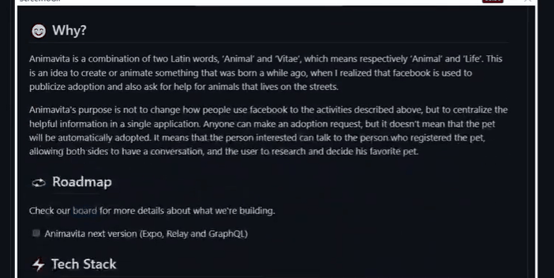

# Projeto com README
um projeto de teste com README 😂




## Tecnologias uilizadas
- HTML
- CSS
- JS

## Como utilizar
1 - Clone o projeto

```
git clone <url>
```

2 - Acesse a pasta do projeto

```
cd repositorio-com-readme
```